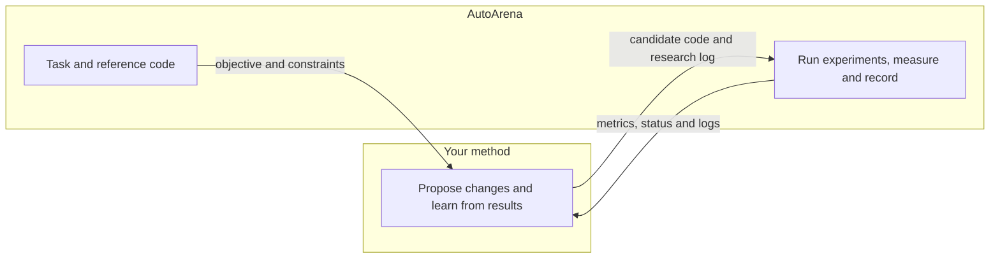

# AutoArena

[📝 Blog](https://auto-research-arena.github.io/auto-research-arena/) · [🏆 Leaderboard](https://auto-research-arena.github.io/auto-research-arena/leaderboard) · [📤 Submit results](site/README.md#add-a-run)

AutoArena benchmarks how well automated research methods improve the efficiency
of language model training and inference. A **method** is the automated research
system being benchmarked: it proposes code changes, runs experiments and uses the
results to decide what to try next.

The benchmark provides [nine tasks](tasks/README.md) covering model size, memory,
computation, training data, training steps, training time and inference latency.
Each task defines a reference program, an experiment budget, an efficiency target
and quality and resource constraints. Results show how much a method improves on
the reference while satisfying those constraints.

## Run your method with the engine

We provide an **engine** that runs your method, executes its candidate code for
training and evaluation, records results and generates submission reports.
**Your method decides what to try; the engine runs the experiments.**

The repository has three main parts:

- [`tasks/`](tasks/README.md): objectives, constraints and reference programs.
- [`examples/`](examples/README.md): method integrations to follow when adapting your own.
- [`engine/`](engine/README.md): experiment execution, run records and submission reports.

To run your method:

1. [Integrate your method](#1-integrate-your-method).
2. [Prepare the run configuration](#2-prepare-for-a-run).
3. [Launch and collect results](#3-launch-and-collect-results).
4. [Export the submission](#4-export-a-submission).



## 1. Integrate your method

### 1.1 Task definitions

Each task provides:

- **An objective:** the efficiency measure to improve.
- **Constraints:** quality and resource requirements, and which code can be changed.
- **Reference code:** the starting implementation.
- **An experiment budget:** the allowed number of experiment launches.

For example, `params` asks the method to reduce model parameters while meeting
the task's quality and resource requirements.

Each task lives under `tasks/<task>/`, with its definition in `task.json` and
reference code in `code/`. See the [task guide](tasks/README.md) for details.

**How your method receives the task.** When the engine starts your method, it
creates a JSON file containing the task location, workspace and reference result.
It sets the environment variable `AUTOARENA_CONTEXT` to this file's path. For the
`params` task, the file contains fields like these:

```json
{
  "task_dir": "/path/to/repo/runs/my-run/engine/task",
  "workspace": "/path/to/repo/runs/my-run/workspace",
  "reference_result": {
    "status": "ok",
    "metrics": {
      "val_bpb": 1.04,
      "num_params_total": 50332176
    }
  }
}
```

- `task_dir` contains the task definition in `task.json` and reference code in
  `code/`. Copy the code to create a candidate and edit only what the task permits.
- `workspace` is the writable directory for candidate code and your method's
  research state.
- The engine measures the reference before starting your method and supplies the
  result in `reference_result`.

### 1.2 Connect to the benchmark API

1. **Load the benchmark task.** Use the inputs described in
   [Section 1.1](#11-task-definitions) to provide your method with the task and
   reference result.
2. **Replace how your method runs experiments.** Instead of running candidate code
   directly, have your method submit it to the benchmark with a short description
   of the proposed change. The benchmark executes the code and returns metrics and
   logs to your method's existing research loop.
3. **Signal completion.** Have your method call `finish` when its research run ends.

When you launch a run, the engine installs the `autoarena` command and Python
client into your method's environment. Use either API at the point where your
method normally runs an experiment; keep proposal generation, search, feedback
and stopping in your method.

<details>
<summary>Command-line API — for agents and scripts</summary>

**Read the supplied task.** Use the inputs described in
[Section 1.1](#11-task-definitions) to load the task and create a candidate
in the supplied workspace.

**Submit experiments.** Set `CANDIDATE_DIR` to the candidate directory your method
created under its supplied workspace, using its full path. Replace the command
that runs the experiment with:

```bash
autoarena evaluate --source "$CANDIDATE_DIR" --request-id experiment-001 \
  --research-log '{"ideas":["Describe the proposed change"]}'
```

Include a short description of the proposed change in `ideas`. Use a unique
request ID for each experiment and save it with the submitted inputs.

The command waits while the engine runs the candidate code, then returns JSON.
Example response:

```json
{
  "status": "ok",
  "metrics": {"val_bpb": 1.03, "num_params_total": 47186446},
  "charged": true,
  "logs": {
    "stdout": "/path/to/autoarena/runs/my-run/logs/0002/attempt-1/stdout.log",
    "stderr": "/path/to/autoarena/runs/my-run/logs/0002/attempt-1/stderr.log"
  }
}
```

- **`status`**: whether the experiment succeeded or failed.
- **`metrics`**: measurements defined by the task, such as parameter count and
  validation quality.
- **`charged`**: whether the experiment counted against the budget.
- **`logs`**: paths to the experiment's standard output and error logs.

For concurrent training, create a JSON array with one entry per candidate.
Each entry contains a unique `candidate_id`, the full candidate-directory path
in `source`, and its `research_log`. Set `BATCH_FILE` to the full path of this
JSON file, then submit it with:

```bash
autoarena evaluate --batch "$BATCH_FILE" --request-id batch-001
```

The engine assigns candidates to the configured workers and returns a JSON array
of results in submission order, with the same fields described above.

**Signal completion.** Call `finish` when the method's research run is complete.
This tells the engine that the method has finished intentionally; exiting without
this call leaves the run paused. `--reason` briefly explains why the method ended
its research run:

```bash
autoarena finish --reason "Experiment budget exhausted"
```

</details>

<details>
<summary>Python API — call from your code</summary>

**Read the supplied task.** `Benchmark.from_context()` reads the file provided
through `AUTOARENA_CONTEXT` and gives your method access to the inputs described
in [Section 1.1](#11-task-definitions):

```python
from autoarena import Benchmark

benchmark = Benchmark.from_context()
task = benchmark.task
seed_code = benchmark.task_dir / "code"
reference = benchmark.reference_result
workspace = benchmark.workspace
```

**Submit experiments.** Set `candidate_directory` to the candidate code your
method created in the supplied workspace. Replace the code that runs the
experiment with:

```python
result = benchmark.evaluate(
    source=candidate_directory,
    request_id="experiment-001",
    research_log={"ideas": ["Describe the proposed change"]},
)
```

Use a unique request ID for each experiment and save it with the submitted inputs.
The call waits for the experiment to finish and returns a Python dictionary:

- **`result["status"]`**: whether the experiment succeeded or failed.
- **`result["metrics"]`**: measurements defined by the task, such as parameter count
  and validation quality.
- **`result["charged"]`**: whether the experiment counted against the budget.
- **`result["logs"]`**: paths to the experiment's standard output and error logs.

For concurrent training, the method can submit candidates in a batch with
`Benchmark.evaluate_batch`; the engine assigns them to the configured workers.

**Signal completion.** Call `finish` when the method's research run is complete.
The argument briefly explains why the method ended its run:

```python
benchmark.finish("Experiment budget exhausted")
```

</details>

More details are in the [engine reference](engine/README.md).

### 1.3 Define the method interface

Create `interface.json` in your method's root directory. It tells the engine how to
install, check, start and resume your method. Your method's installation commands
set up its environment and dependencies; the engine runs the commands you provide.

Commands run from your method's root directory. Supply script paths relative to
that directory.

Choose one of two values for `entry_type`:

- **`cli`:** The method's research loop is implemented in code. Set `start` and
  `resume` to the commands that run that code.
- **`prompt`:** A coding agent follows the method's research instructions. Add
  `"prompt_file": "prompt.md"` and write the instructions in that file. Set
  `start` and `resume` to the coding-agent CLI commands. The engine sends your
  prompt unchanged on stdin; `AUTOARENA_CONTEXT` supplies the context JSON path.

```json
{
  "id": "my-method",
  "entry_type": "cli",
  "workers": 1,
  "environment": {
    "setup": [["bash", "install.sh"]],
    "check": ["bash", "check.sh"]
  },
  "start": ["bash", "run.sh"],
  "resume": ["bash", "run.sh", "--resume"]
}
```

- `workers` sets how many candidates the method can train concurrently.
- `environment.setup` lists the method's installation commands.
- `environment.check` checks that the method is ready to run.
- `start` launches the method; `resume` continues its saved research state.

The example uses shell scripts; replace these with your method's own commands,
including any environment activation they need.

See the [interface reference](engine/README.md#method-interface) for details.

### 1.4 Integration examples

<details>
<summary>GEAR — adapt a coding-agent method with the command-line API</summary>

GEAR uses genetic search to evolve training code. In the GEAR-Fixed variant used
here, `gear.py` selects parents from an elite population and chooses mutation
(modify one parent) or crossover (combine ideas from two parents). A coding agent
implements each candidate, and experiment results guide updates to the population.

The benchmark integration prompt,
[prompt.md](examples/gear/prompt.md), tells the agent to read
[GEAR's existing prompt](examples/gear/upstream/program_gear_fixed.md)
and apply the benchmark-specific changes below.
The excerpts below are actual instructions given to the GEAR agent.

**1. Launch and interface integration**

Our [interface.json](examples/gear/interface.json) uses a prompt
entry with one worker and starts or resumes the same Claude session.
Our [check.py](examples/gear/check.py) checks the pinned controller,
benchmark client and Claude CLI. The integration prompt supplies the task inputs
described in [Section 1.1](#11-task-definitions):

```text
Use this run's `task_dir/task.json` and `task_dir/code/` as the task and reference.
Read the task's objective and complete constraints before proposing candidates.
```

It also places the native Git workspace and submitted candidate directories
under this run's supplied `workspace`.

**2. Measurement and accounting**

The integration prompt replaces direct training with a benchmark request:

```text
Replace `uv run train.py` with `autoarena evaluate --source ABS_CANDIDATE
--request-id UNIQUE_ID --research-log-file ABS_RESEARCH_JSON`.
```

The benchmark supplies the training duration and records the research log with
each request. Its measured reference initializes GEAR's baseline. The integration prompt
also specifies when to stop:

```text
The task's launch budget is the only limit. Keep requesting suggestions and
evaluating candidates until the benchmark refuses a further launch, then call
`autoarena finish` with your actual stopping reason.
```

**3. Score normalization**

GEAR uses fixed score thresholds, so our
[score.py](examples/gear/score.py) normalizes the task's target
by a reference value before passing it to the controller's `val_bpb` field.

The integration prompt tells the agent how to use this helper:

```text
For a child, save its canonical result JSON and use
`python <source>/score.py --result ABS_RESULT_JSON`. The helper only translates
observations into the historical controller fields; you call `gear.py record-run`
and write the scientific reflection yourself.
```

**4. Task constraint check**

We added a [constraint check](examples/gear/constraints.patch)
to exclude candidates that violate task constraints from consideration for the
elite population.

See the [complete GEAR integration](examples/gear/) for all files.

</details>

## 2. Prepare for a run

**1. Set up the engine and prepare data**

Experiments require Linux, bubblewrap (`bwrap`) and a local NVIDIA A100-SXM4-80GB GPU.
From the repository root, run:

```bash
curl -LsSf https://astral.sh/uv/install.sh | sh
source "$HOME/.local/bin/env"
uv sync --python 3.10
uv run python scripts/prepare_local.py
```

`uv sync` creates the engine's Python environment and installs the project.
The preparation script uses Python 3.10 to install the shared task dependencies
and prepares the dataset and tokenizer in `data/autoresearch/`.

If your method uses a coding-agent CLI, such as Claude Code, install and
authenticate it before launching the run. The engine starts it using the command
in `interface.json`.

**2. Create the run configuration**

`interface.json` defines how to install, check, start and resume your method.
`run-config.json` selects the task, method, GPUs and output directory.

Save the following as `run-config.json`.
Paths are relative to the AutoArena repository root:

```json
{
  "task": "params",
  "method": "examples/my-method/interface.json",
  "run_dir": "runs/my-method-params",
  "research_llm": {
    "provider": "claude",
    "model": "opus5",
    "check": [
      "claude", "--model", "us.anthropic.claude-opus-5[1m]", "--effort", "medium", "-p",
      "Reply with exactly: Benchmark uses opus5."
    ]
  },
  "compute": {
    "backend": "local",
    "visible_devices": [0]
  }
}
```

Set `method` to your `interface.json` path.
List one local GPU index in `compute.visible_devices` for each worker specified
by `workers` in [Section 1.3](#13-define-the-method-interface). Use a new `run_dir` for
each run; the engine creates and manages it.

Record the LLM used by your method in `research_llm`. Its optional `check` command
tests access to that model. Use `{"used": false}` for methods without an LLM.
The example probe uses this deployment's Opus 5 model ID; use the ID accepted by
your Claude service in both the probe and your method's launch commands.

## 3. Launch and collect results

```bash
uv run python -m engine check --config run-config.json
uv run python -m engine run --config run-config.json
```

The check command reports API, method interface, local GPU, data and
measurement-runtime readiness, plus an LLM probe when configured.

The run command installs and checks the method environment, measures the
reference, then starts your method with
`AUTOARENA_CONTEXT`. Your method submits candidates and calls `finish` when its
research run is complete.

Inspect the run and collect its measurements, using your configuration's `run_dir`:

```bash
uv run python -m engine status --run runs/my-method-params
uv run python -m engine collect --run runs/my-method-params
```

See the [command guide](engine/README.md#lifecycle-and-evidence) for stopping and
resuming runs. After completion, export the submission below.

<details>
<summary>Example: configure and run GEAR on params</summary>

GEAR uses Claude Code and one training worker. Initialize its upstream code:

```bash
git submodule update --init examples/gear/upstream
```

Save this complete configuration as `gear-run-config.json`:

```json
{
  "task": "params",
  "method": "examples/gear/interface.json",
  "run_dir": "runs/gear-params-local-demo",
  "research_llm": {
    "provider": "claude",
    "model": "opus5",
    "check": [
      "claude", "--model", "us.anthropic.claude-opus-5[1m]", "--effort", "medium", "-p",
      "Reply with exactly: Benchmark uses opus5."
    ]
  },
  "compute": {
    "backend": "local",
    "visible_devices": [0]
  }
}
```

Check the setup, launch GEAR and collect its results:

```bash
uv run python -m engine check --config gear-run-config.json
uv run python -m engine run --config gear-run-config.json
uv run python -m engine status --run runs/gear-params-local-demo
uv run python -m engine collect --run runs/gear-params-local-demo
```

</details>

## 4. Export a submission

Each submission reports one run of a method on one task. The report includes:

- the best qualifying result, reference, improvement and task-defined constraints;
- GPU instance/model, configured workers, GPUs per candidate and recorded research LLM;
- experiment history with recorded ideas, full research accounts, logs and budget usage;
- exact winning and reference code, their diff, source hashes and reproduction details.

After the run finishes, pass the `run_dir` from your run configuration to `--run`
and choose a directory for `--output`. For example:

```bash
uv run python -m engine submission --run runs/my-method-params \
  --output runs/my-method-params/submission
```

Open `submission.html` in the directory passed to `--output`. Share that whole
directory so its source and evidence links travel with the report.

To join the public leaderboard, convert the exported results to website JSON
and submit those files in a PR. Artifact download links can be added when ready.

```bash
python3 -m pip install -r site/requirements.txt
python3 scripts/leaderboard.py add \
  --submission runs/my-method-params/submission/submission.json \
  --output site/submissions/my-method/params

python3 scripts/leaderboard.py check \
  site/submissions/my-method/params/submission.json
```

The helper writes the common website result format and an empty `artifacts.json`.
Pass `--artifacts-url URL` when a code and logs archive is available. Commit both
files for each run; one PR can include all targets for your method. The check
command validates the recorded values and counts. See the
[public submission instructions](site/README.md#add-a-run) for artifact links
and building the website.

<details>
<summary>Example: export the GEAR submission</summary>

```bash
uv run python -m engine submission --run runs/gear-params-local-demo \
  --output runs/gear-params-local-demo/submission
```

</details>

The page works offline. The public JSON format is defined in
[submission.schema.json](engine/schema/submission.schema.json). See the
[submission guide](engine/README.md#submissions) for the artifact layout and batch
export.
